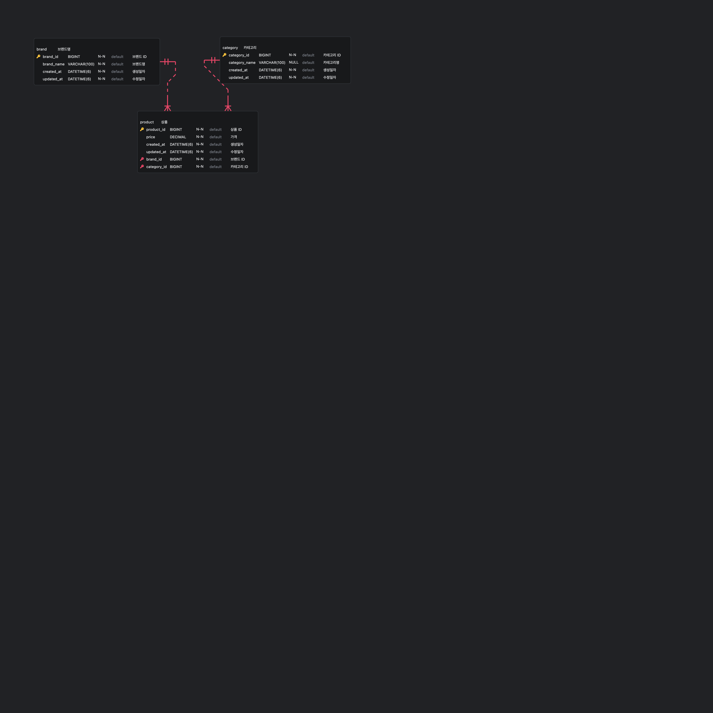

# 🛒 쇼핑몰 상품 관리 API
---

## 📌 1. 구현 범위

### ✅ 상품 조회 API
- **카테고리 별 최저가격 브랜드와 상품 가격, 총액을 조회하는 API**
    - (`GET /categories/lowest-price`)
- **단일 브랜드로 모든 카테고리 상품을 구매할 때 최저가격에 판매하는 브랜드와 카테고리의 상품가격, 총액을
  조회하는 API**
    - (`GET /brand/lowest-price`)
- **카테고리 이름으로 최저, 최고 가격 브랜드와 상품 가격을 조회하는 API**
    - (`GET /categories/prices/min-max`)

### ✅ 상품 등록/수정/삭제 API
- **브랜드 및 상품 추가 API**
    - (`POST /product`)
- **브랜드 및 상품 업데이트 API**
   - (`PATCH /product`)
- **브랜드 및 상품 추가 API**
   - (`DELETE /product`)

---

## ⚙️ 2. 코드 빌드 & 실행 방법

### ✅ 코드 빌드 & 실행
```bash
git clone https://github.com/insukChoi/shopping.git
cd shopping

## 서버
./gradlew clean build
./gradlew bootRun

## 프론트
cd src/ui
npm install
npm run dev
```
### ✅ H2 DB console 접속
```
http://localhost:8080/h2-console/

JDBC URL = jdbc:h2:mem:mydb
USER NAME = sa
PASSWORD = (없음)
```

## 🚀 3. API 실행 예제
API 요청을 테스트하려면 [client/client.http](client/client.http) 파일을 참고하세요.

### 1️⃣ 카테고리 별 최저가격 브랜드와 상품 가격, 총액을 조회하는 API
### ✅ 요청
```http request
GET /shopping/v1/categories/lowest-price
```

### ✅ 응답 (200 OK)
```json
{
  "contents": [
    {
      "categoryName": "상의",
      "brandName": "C",
      "price": 10000.0000
    },
    {
      "categoryName": "아우터",
      "brandName": "E",
      "price": 5000.0000
    },
    {
      "categoryName": "바지",
      "brandName": "D",
      "price": 3000.0000
    },
    {
      "categoryName": "스니커즈",
      "brandName": "G",
      "price": 9000.0000
    },
    {
      "categoryName": "가방",
      "brandName": "A",
      "price": 2000.0000
    },
    {
      "categoryName": "모자",
      "brandName": "D",
      "price": 1500.0000
    },
    {
      "categoryName": "양말",
      "brandName": "I",
      "price": 1700.0000
    },
    {
      "categoryName": "액세사리",
      "brandName": "F",
      "price": 1900.0000
    }
  ],
  "totalPrice": 34100.0000
}
```

### 2️⃣ 단일 브랜드로 모든 카테고리 상품을 구매할 때 최저가격에 판매하는 브랜드와 카테고리의 상품가격, 총액을 조회하는 API
### ✅ 요청
```http request
GET /shopping/v1/brand/lowest-price
```

### ✅ 응답 (200 OK)
```json
{
  "lowestPrice": {
    "brandName": "D",
    "categories": [
      {
        "categoryName": "상의",
        "price": 10100.0000
      },
      {
        "categoryName": "아우터",
        "price": 5100.0000
      },
      {
        "categoryName": "바지",
        "price": 3000.0000
      },
      {
        "categoryName": "스니커즈",
        "price": 9500.0000
      },
      {
        "categoryName": "가방",
        "price": 2500.0000
      },
      {
        "categoryName": "모자",
        "price": 1500.0000
      },
      {
        "categoryName": "양말",
        "price": 2400.0000
      },
      {
        "categoryName": "액세사리",
        "price": 2000.0000
      }
    ],
    "totalPrice": 36100.0000
  }
}
```

### 3️⃣ 카테고리 이름으로 최저, 최고 가격 브랜드와 상품 가격을 조회하는 API
### ✅ 요청
```http request
GET /shopping/v1/categories/prices/min-max?category_name=상의
```

### ✅ 응답 (200 OK)
```json
{
  "categoryName": "상의",
  "lowestPrice": {
    "brandName": "C",
    "price": 10000.0000
  },
  "highestPrice": {
    "brandName": "I",
    "price": 11400.0000
  }
}
```

### 4️⃣ 브랜드 및 상품 추가 API
### ✅ 요청
```http request
POST /shopping/v1/product
Content-Type: application/json

{
  "brand_name": "J",
  "category_name": "벨트",
  "price": 7000
}
```

### ✅ 응답 (201 CREATED)
```json
{
  "price": 7000.0000,
  "createdAt": "2025-03-02T14:06:02.220002",
  "updatedAt": "2025-03-02T14:06:02.220005",
  "brand": {
    "name": "J",
    "createdAt": "2025-03-02T14:06:02.218261",
    "updatedAt": "2025-03-02T14:06:02.218271"
  },
  "category": {
    "name": "벨트",
    "createdAt": "2025-03-02T14:06:02.219214",
    "updatedAt": "2025-03-02T14:06:02.219217"
  }
}
```

### 5️⃣ 브랜드 및 상품 업데이트 API
### ✅ 요청
```http request
PATCH /shopping/v1/product
Content-Type: application/json

{
  "brand_name": "A",
  "category_name": "바지",
  "price": 2000
}
```

### ✅ 응답 (200 OK)
```json
{
  "price": 2000.0000,
  "createdAt": "2025-03-02T12:20:22.549463",
  "updatedAt": "2025-03-02T12:20:22.549463",
  "brand": {
    "name": "A",
    "createdAt": "2025-03-02T12:20:22.547509",
    "updatedAt": "2025-03-02T12:20:22.547509"
  },
  "category": {
    "name": "바지",
    "createdAt": "2025-03-02T12:20:22.548601",
    "updatedAt": "2025-03-02T12:20:22.548601"
  }
}
```

### 6️⃣ 브랜드 및 상품 삭제 API
### ✅ 요청
```http request
DELETE /shopping/v1/product
Content-Type: application/json

{
  "brand_name": "J",
  "category_name": "벨트"
}
```

### ✅ 응답 (204 NO_CONTENT)
```
HTTP/1.1 204

<Response body is empty>
```

## 📄 4. 기타 추가 정보
### ✅ 데이터베이스 ERD


### ✅ 기술 스택
- Spring Boot 3.4.3
- Kotlin 2.0.10
- Exposed (Kotlin SQL library)
- Kotest + Mockk + fixtureMonkey (테스트)
- H2 (DB)
- Gradle + libs.versions.toml (버전 관리)
- react + react-query (프론트 화면)

### ✅ 프로젝트 구조
```
src
├── main
│   ├── kotlin/com/insuk/shopping
│   │   ├── adapter/input/web  # Controller 계층
│   │   ├── adapter/output/persistence  # Repository (DB 접근)
│   │   ├── application  # UseCase (비즈니스 로직)
│   │   │   ├── domain/model  # Domain
│   │   │   ├── domain/usecase  # UseCase
│   │   │   ├── port/input  # Input Port (UseCase Interface)
│   │   │   ├── port/output  # Output Port (Repository Interface)
│   │   ├── common  # Utils 파일
│   │   ├── config  # 설정 파일
│   │   ├── exception  # 예외 Handler 및 에러코드
│   ├── resources
│   │   ├── application.yml  # 환경 설정
│   │   ├──sql
│   │   │   ├── data.sql  # 초기 데이터 삽입
│   │   │   ├── schema.sql # DB 테이블 생성
```
### ✅ 프론트 화면구성
#### 1️⃣ 카테고리별 최저가격 브랜드와 가격 화면


#### 2️⃣ 단일 브랜드의 모든 카테고리 최저가격 화면


#### 3️⃣ 최저, 최고가격 브랜드와 가격 화면


#### 4️⃣ 상품 추가/수정/삭제 관리 화면

